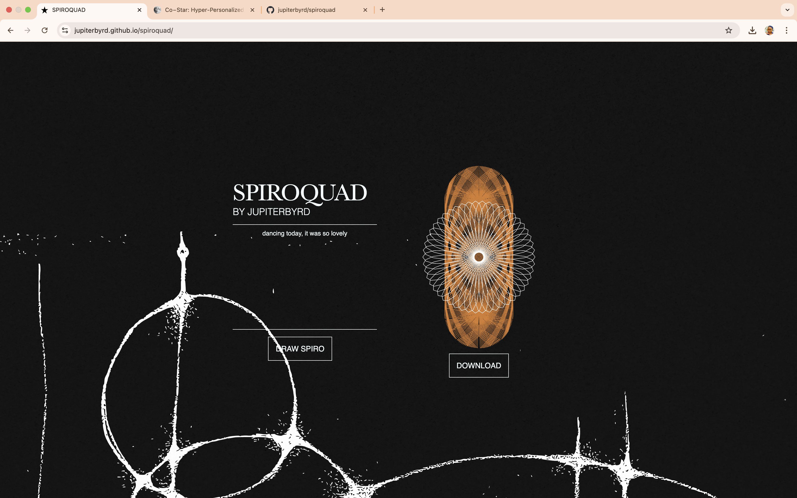

# 🎠 Spiroquad 
## Whimsical Quadrilateral Spirograph Generator

Welcome to **Spiroquad**, a playful spirograph toy built in HTML, CSS, and JavaScript.

🌀 **What is it?**  
**Spiroquad** lets you generate beautiful, gear-like looping patterns — but with a twist: the “gear” is a quadrilateral! Combine this geometric base with your own text input to hash out unique spirographs, infused with hidden sentiment and whimsy.



---

## ✨ Features

✅ Draw spirographs using quadrilaterals instead of boring circles  
✅ Input text to hash into quirky parameters  
✅ Hidden encoding adds surprises to every spiral  
✅ Download your creations as crisp, clean SVGs  
✅ Hidden metadata “Easter eggs” for curious explorers  
✅ Duo-tone overlays for iconic visuals (coming soon!)

---

## 🚀 Live Demo

[👉 Try Spiroquad on GitHub Pages](https://jupiterbyrd.github.io/spiroquad/)

---

## 📦 How it Works

1. Type or paste any text into the textarea.
2. Your text is hashed and analyzed for sentiment.
3. Hash and sentiment generate spirograph parameters.
4. A quadrilateral “gear” spins a smaller gear to plot the path.
5. Watch the shape draw itself in real time.
6. Hover to reveal the **Download** button — grab your masterpiece as an SVG!

---

## 🔮 Tech Stack

- **HTML & CSS** — minimal, clean, and whimsical.
- **JavaScript** — OOP spirograph logic, hashing, and SVG generation.
- **SVG** — all graphics are scalable and crisp.

---

## 🗝️ Easter Eggs

This repo hides tiny secrets in the SVG metadata — peek inside the downloaded file if you dare!  
They don’t affect the visuals, but add a layer of mystery for the curious.

---

## 📥 Download & Run Locally

```bash
git clone https://github.com/jupiterbyrd/spiroquad.git
cd spiroquad
# Open index.html in your browser
